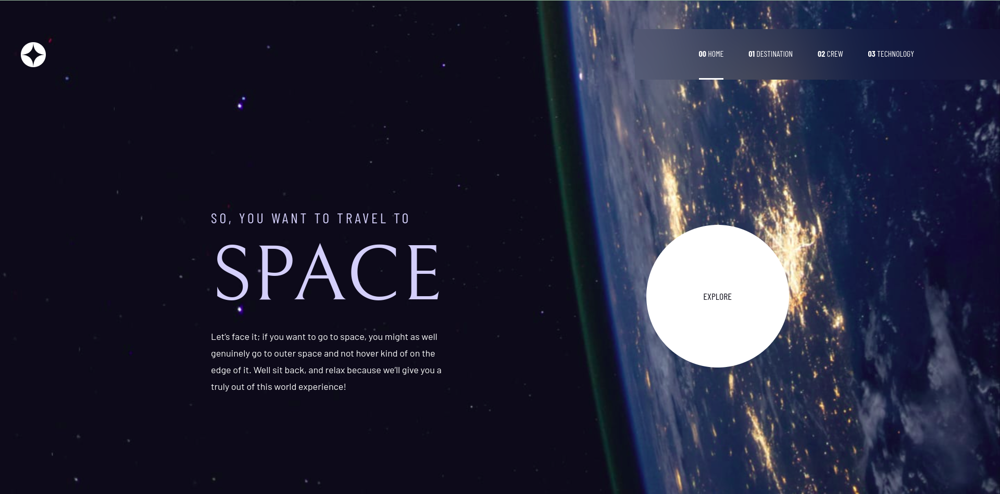

# Frontend Mentor - Space tourism website solution

This is a solution to the [Space tourism website challenge on Frontend Mentor](https://www.frontendmentor.io/challenges/space-tourism-multipage-website-gRWj1URZ3). Frontend Mentor challenges help you improve your coding skills by building realistic projects.

## Table of contents

- [Overview](#overview)
  - [The challenge](#the-challenge)
  - [Screenshot](#screenshot)
  - [Links](#links)
- [My process](#my-process)
  - [Built with](#built-with)
  - [What I learned](#what-i-learned)
  - [Continued development](#continued-development)
- [Author](#author)

## Overview

### The challenge

Users should be able to:

- View the optimal layout for each of the website's pages depending on their device's screen size
- See hover states for all interactive elements on the page
- View each page and be able to toggle between the tabs to see new information

### Screenshot

### Links

- Solution URL: [github link](https://github.com/almamarie/HTML-CSS-Space-tourism-website-Frontend-Masters.git)
- Live Site URL: [Add live site URL here](https://your-live-site-url.com)

## My process

### Built with

- Semantic HTML5 markup
- CSS custom properties
- Flexbox
- CSS Grid
- Desktop-first workflow
- JavaScript

### What I learned

I really learned a lot while working on this project. My HTML5 and CSS3 and my JavaScript skills has increased a lot. I learned the areas I need to work on. Outlined below are some of the things I learned:

- I have learned that I need to always take a look at all the designs (desktop, tablet, and mobile) before I start designing. I finished with my design and when I was making the pages to respond to mobile and tablet also, I realised that I had to change so many things. At some point, I had to go back and redesign one of the pages all over again. I need to add that to my project planning phase.

- I also learned that I need to find a proper planning system/tool for my projects. This was also tied to getting enough screens for my coding because I have been using my laptop's screen only and I always need to have the code I am writing (HTML and CSS always opened when I am designing and Javascript also), I also needed to have the design file(figma) always opened so I can alwayd refer and finally, the output of my code on another screen. Because I didn't have these screens, I kept going backa and forth whcih always got me confused. I finished the project in 4 days but I believe I could have done it in a shorter time if I had these sorted out.

### Continued development

Some concepts I need to develop are outlined below:

- I need to understand how to develop multipage websites with only JS, HTML and CSS. I struggled with this so much that could complete it. Google search only showed me "developing multipage website with REACT" not Javascript only

-I also need to understand how to create multipage websites with the MVP architecture. Because I couldn't solve the above problem (creating multipage websites with JS only), I could experiment with this. I successfully got it to work for only 1 page but the momment the page changes, I get an error.

- The final this is how to check for changes in screen size (responsive design) with JS DOM. This project required a different image (landscape and portrait) for mobile/tablet and desktop designs but I couldn't do it.

## Author

- LinkedIn - [Louis Marie Atoluko Ayariga](www.linkedin.com/in/marieloumar)
- Frontend Mentor - [@almamarie](https://www.frontendmentor.io/profile/almamarie)
